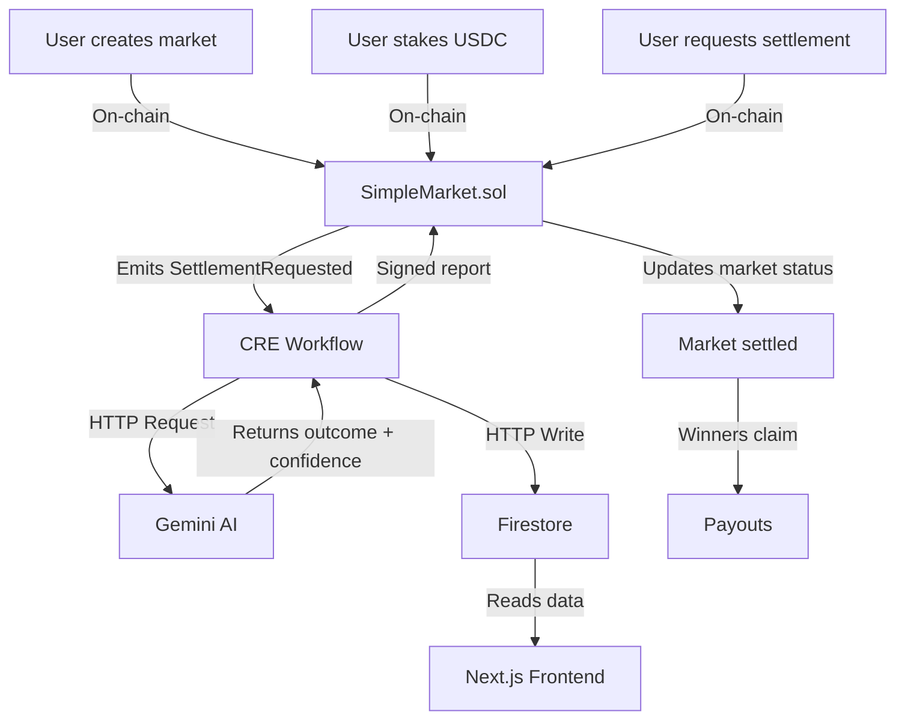
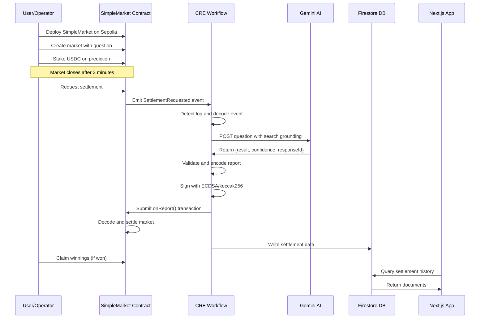

# Chainlink Runtime Environment (CRE) × Google Cloud – Prediction Market Demo

This repository demonstrates an end-to-end **automated, AI-powered prediction market** using the **Chainlink Runtime Environment (CRE)** integrated with Google's Gemini AI and Firebase.

## Table of Contents

- [What This Demo Does](#what-this-demo-does)
- [Repository Structure](#repository-structure)
  - [1. CRE Workflow Directory](#1-cre-workflow-directory)
  - [2. Contracts Directory](#2-contracts-directory)
  - [3. Frontend Directory](#3-frontend-directory)
- [How It Works](#how-it-works)
  - [Architecture Overview](#architecture-overview)
  - [Flow of Operations](#flow-of-operations)
- [Prerequisites](#prerequisites)
- [Quick Start](#quick-start)
  - [Option 1: Test CRE Workflow Only (Fastest)](#option-1-test-cre-workflow-only-fastest)
  - [Option 2: Full End-to-End Test](#option-2-full-end-to-end-test)
- [Security Considerations](#security-considerations)

## What This Demo Does

This project showcases how to build a fully automated prediction market system where:

1. Users create markets by asking binary (Yes/No) questions on-chain
2. Users stake ERC-20 tokens (USDC) to make predictions
3. After the market closes, anyone can request settlement
4. **CRE automatically triggers** when it detects the settlement request
5. **Gemini AI** determines the factual outcome using Google search grounding
6. **CRE submits** a cryptographically signed settlement report back on-chain
7. Settlement data is stored in **Firestore** for audit and display
8. Winners claim their proportional share of the total pool

**Key Technologies:**
- **Smart Contracts**: Solidity prediction market with CRE receiver integration
- **CRE**: Event-driven workflow orchestration
- **Gemini AI**: Automated fact-checking and outcome determination
- **Firebase/Firestore**: Audit trail and data persistence
- **Next.js Frontend**: User interface for viewing settlement history

## Repository Structure

This repository contains three main components:

```
.
├── contracts/              # Foundry project: SimpleMarket.sol and deployment scripts
├── cre-workflow/           # CRE TypeScript workflow for AI-powered settlement
├── frontend/               # Next.js app for viewing settlement data from Firestore
├── firebase-setup.md       # Firebase/Firestore configuration guide
└── README.md              # This file
```

### 1. CRE Workflow Directory

A Chainlink Runtime Environment project containing:
- TypeScript workflow orchestration
- Gemini AI integration
- EVM settlement logic
- Firestore database integration
- Configuration and secrets management

**[Read the CRE Workflow README →](cre-workflow/README.md)**

### 2. Contracts Directory

A Foundry project containing:
- `SimpleMarket.sol` - Binary prediction market smart contract
- Comprehensive test suite
- Deployment and interaction scripts
- CRE receiver template integration

**[Read the Contracts README →](contracts/README.md)**

### 3. Frontend Directory

A Next.js application that:
- Connects to Firestore database
- Displays recent market settlements
- Shows AI responses, confidence scores, and transaction hashes
- Provides a simple UI for monitoring the system

## How It Works

### Architecture Overview



### Flow of Operations



## Prerequisites

To run this demo, you'll need:

- [Git](https://git-scm.com/book/en/v2/Getting-Started-Installing-Git)
- [Node.js](https://nodejs.org/en/download) v20+
- [Bun](https://bun.sh/) (JavaScript runtime and package manager)
- [Foundry/Forge](https://github.com/foundry-rs/foundry) (`forge`, `cast`, `anvil`)
- [Chainlink Runtime Environment CLI](https://docs.chain.link/)
- [Gemini API Key](https://aistudio.google.com/api-keys)
- [Firebase Project](./firebase-setup.md) with Firestore enabled
- [ETH Sepolia funds](https://faucets.chain.link/) for gas
- [USDC on Sepolia](https://faucet.circle.com/) for market participation

## Quick Start

### Option 1: Test CRE Workflow Only (Fastest)

This repo ships with the address of a pre-deployed contract and transaction for immediate testing.

```bash
# 1. Install dependencies
cd cre-workflow/prediction-market-demo
bun install

# 2. Configure RPC endpoint
# Edit cre-workflow/project.yaml and set your Sepolia RPC URL for local-simulation


cd ..  # Back to cre-workflow directory

# 3. Set environment variables. Create .env file from example
cp .env.example .env

# Populate the .env file with your ETH private key, Gemini API key, Firebase API key, and Firebase project ID.

# 4. Run simulation
cre workflow simulate prediction-market-demo --target local-simulation

# 5. When prompted, use this pre-deployed transaction:
# Transaction hash: 0x24f3ccee54786d754ee07e4b8578ff6916c3cfca6e0f6fd71675aaad0039bc19
# Event index: 0
```

**Environment Variables** (`cre-workflow/.env`):
```bash
CRE_ETH_PRIVATE_KEY=0x...       # Private key with Sepolia ETH
CRE_TARGET=local-simulation
GEMINI_API_KEY_VAR=...          # From https://aistudio.google.com/api-keys
FIREBASE_API_KEY_VAR=...        # From Firebase console
FIREBASE_PROJECT_ID_VAR=...     # From Firebase console
```

See the [prerequisites](#prerequisites) section for information on obtaining your Gemini and Firebase keys.

### Option 2: Full End-to-End Test

#### Step 1: Clone Repository

```bash
git clone https://github.com/smartcontractkit/cre-gcp-prediction-market-demo.git
cd cre-gcp-prediction-market-demo
```


#### Step 2: Install Contract Dependencies

```bash
cd contracts
forge install
```


#### Step 3: Set Environment Variables for Contract Deployment

```bash
export PRIVATE_KEY=...
export RPC_URL=...
```


#### Step 4: Deploy a New SimpleMarket

The provided constructor arguments are: (1) the payment token address (USDC on ETH Sepolia) and (2) the CRE forwarder address ([ETH Sepolia CRE Simulation Forwarder](https://docs.chain.link/cre/guides/workflow/using-evm-client/supported-networks-ts#understanding-forwarder-addresses)).

```bash
forge create src/SimpleMarket.sol:SimpleMarket \
  --broadcast \
  --rpc-url $RPC_URL \
  --private-key $PRIVATE_KEY \
  --constructor-args 0x1c7D4B196Cb0C7B01d743Fbc6116a902379C7238 0x15fC6ae953E024d975e77382eEeC56A9101f9F88
```

Note down the new contract address and export it:

```bash
export MARKET_ADDRESS=...
```

> [!WARNING]
> The provided [`ReceiverTemplate.sol`](./contracts/src/interfaces/ReceiverTemplate.sol) includes setter functions to enable access control of the `onReport` function which are not used in this end to end test. See [the CRE docs](https://docs.chain.link/cre/guides/workflow/using-evm-client/onchain-write/building-consumer-contracts#34-configuring-permissions) for best practices.


#### Step 5: Get the Next Available Market ID

Check the `nextMarketId`:

```bash
cast call $MARKET_ADDRESS \
  "nextMarketId()" \
  --rpc-url $RPC_URL
```

Use Foundry's `cast` command to convert this from hex to decimal:

```bash
cast to-dec 0x000000000000000000000000000000000000000000000000000000000000001c
# Example output: 28
# This number increments each time a new market is created.
# The first market ID for a new contract will be 0.
```

This marketID will be used in future steps.


#### Step 6: Create a New Market

```bash
cast send $MARKET_ADDRESS \
  "newMarket(string)" \
  "Will the buffalo bills win the 2025 superbowl?" \
  --rpc-url $RPC_URL \
  --private-key $PRIVATE_KEY
```

> [!IMPORTANT]
> Markets close after 3 minutes. Complete both step 7 and 6 before it closes!

#### Step 7: (Optional) Approve USDC for wager

Approve the SimpleMarket contract to spend your USDC. 

```bash
# USDC on Sepolia: 0x1c7D4B196Cb0C7B01d743Fbc6116a902379C7238
# Amount: In USDC (6 decimals), so 1000000 = 1 USDC
cast send 0x1c7D4B196Cb0C7B01d743Fbc6116a902379C7238 \
  "approve(address,uint256)" \
  $MARKET_ADDRESS \
  1000000 \
  --rpc-url $RPC_URL \
  --private-key $PRIVATE_KEY
```

#### Step 8: (Optional) Place a prediction

Place your prediction, wagering some amount of USDC.

```bash
# MarketID: Your market ID from step 5
# Outcome: 1 = No, 2 = Yes
# Amount: In USDC (6 decimals), so 1000000 = 1 USDC
cast send $MARKET_ADDRESS \
  "makePrediction(uint256,uint8,uint256)" \
  0 \
  2 \
  1000000 \
  --rpc-url $RPC_URL \
  --private-key $PRIVATE_KEY
```

#### Step 9: Install Workflow Dependencies

```bash
cd ../cre-workflow/prediction-market-demo
bun install
```


#### Step 10: Configure Workflow Settings

Add your market address to `cre-workflow/prediction-market-demo/config.json`:

```json
{
  "geminiModel": "gemini-2.5-flash",
  "evms": [
    {
      "marketAddress": "",
      "chainSelectorName": "ethereum-testnet-sepolia",
      "gasLimit": "1000000"
    }
  ]
}
```


#### Step 11: Configure RPC Endpoint

Add ETH Sepolia RPC URL to `cre-workflow/project.yaml`:

```yaml
local-simulation:
  rpcs:
    - chain-name: ethereum-testnet-sepolia
      url: <your_rpc_url>
```


#### Step 12: Setup Environment Variables

Navigate to the `cre-workflow` directory and copy the example `.env`:

```bash
cd ..
cp .env.example .env
```


#### Step 13: Populate Environment Variables

Open `.env` and add your private key, gemini key, firebase key, and firebase project id.

```
CRE_ETH_PRIVATE_KEY=

# Profile to use for this environment (e.g. local-simulation, production, staging)
CRE_TARGET=local-simulation

# Gemini configuration: API Key
GEMINI_API_KEY_VAR=

# Firebase configuration: API Key & Project Id
FIREBASE_API_KEY_VAR=
FIREBASE_PROJECT_ID_VAR=

```

#### Step 14: Request Settlement of the Market

> [!IMPORTANT]
>  Market must be closed before settlement can be requested. By default, markets close after 3 minutes. Make sure to use the market ID obtained from step 5.

```bash
cast send $MARKET_ADDRESS \
  "requestSettlement(uint256)" \
  0 \
  --rpc-url $RPC_URL \
  --private-key $PRIVATE_KEY
```

**Note the Transaction Hash** - you will need this one!

#### Step 15: (Optional) Simulate the Workflow

Run CRE in simulation mode to test the workflow without the `--broadcast` flag:

```bash
cre workflow simulate prediction-market-demo --target local-simulation
```

**Note:** This will:
- Run CRE locally in simulation mode
- Make a real HTTP request to Gemini
- Make a real HTTP POST request to Firebase
- **NOT** write results on-chain (no `--broadcast` flag)


When prompted, enter the txn hash from step 14 and enter the log index of `0`.


#### Step 16: Broadcast the Workflow Transaction

Execute the workflow and write results on-chain:

```bash
cre workflow simulate prediction-market-demo --target local-simulation --broadcast
```

When prompted, enter the txn hash from step 14 and enter the log index of `0`.

#### Step 16.5: (Conditional, see warning) Manual market settlement

> [!IMPORTANT]
> This function can only be called if the response from Gemini was INCONCLUSIVE. This is a fallback mechanism to allow operators to manually settle inconclusive markets.

```bash
# Manually settle a market that Gemini could not settle
# MarketID: Your market ID from step 5
# Outcome: 1 = No, 2 = Yes
cast send $MARKET_ADDRESS \
  "settleMarketManually(uint256,uint8)" \
  0 \
  2 \
  --rpc-url $RPC_URL \
  --private-key $PRIVATE_KEY
```

#### Step 17: (Optional) Claim your prediction

```bash
# Claim your wager after the market is settled
# MarketID: Your market ID from step 5
cast send $MARKET_ADDRESS \
  "claimPrediction(uint256)" \
  0 \
  --rpc-url $RPC_URL \
  --private-key $PRIVATE_KEY
```

If you made the correct prediction, your portion of the wager pool will be returned to you.

Potential errors thrown:
```
NotSettledYet(Status current)   // Market hasn't been settled yet
AlreadyClaimed()                // User already claimed their winnings
NoWinners()                     // No one predicted the winning side
IncorrectPrediction()           // User made the incorrect prediction
```

#### Step 18: Setup the Frontend

Navigate to the frontend directory:

```bash
cd ../frontend
bun install
```


#### Step 19: Configure Frontend Environment

Copy the example environment file:

```bash
cp .env.local.example .env.local
```

Open `.env.local` and add your Firebase project details:
```
NEXT_PUBLIC_FIREBASE_API_KEY="your-api-key"
NEXT_PUBLIC_FIREBASE_AUTH_DOMAIN="your-auth-domain"
NEXT_PUBLIC_FIREBASE_PROJECT_ID="your-project-id"
```


#### Step 20: Run the Frontend

```bash
bun run dev
```

The frontend will be available at `http://localhost:3000`

## Security Considerations

**⚠️ Important Notes:**

1. **This is a demo project** - Not audited or production-ready
2. **Never commit secrets** - Keep `.env` out of version control
3. **Test with small amounts** - Use testnet tokens only
4. **Verify AI responses** - Gemini responses may be incorrect or biased
5. **Monitor gas usage** - Settlement transactions consume gas from your account
