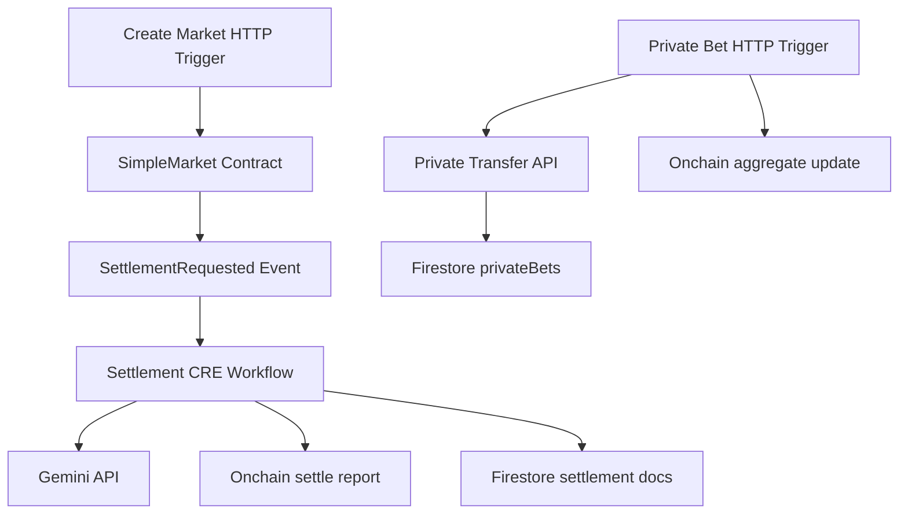

# VeritasX: CRE + Gemini + Firebase Prediction Market

This repository contains an end-to-end prediction market demo built with Chainlink Runtime Environment (CRE), Gemini, Firebase, and Sepolia smart contracts.

It supports:
- market creation by HTTP workflow
- private YES/NO betting flow with EIP-712 signatures
- aggregate pool updates onchain
- settlement triggered from contract events
- Firestore storage for offchain indexing and settlement support

## What is in this repo

- `contracts/`: public prediction market contract (`SimpleMarket.sol`) + Foundry tests/scripts.
- `cre-workflow/`: CRE project and workflow code (create, private bet, settlement, private settlement).
- `private contract/`: private token + vault + API integration examples (ACE/compliant private transfer demo).
- `frontend/`: Next.js app for reading settlement/audit data.
- `firebase-setup.md`: Firebase setup and checks.
- `firestore.rules`: Firestore rule template used by workflows.

## Architecture


```mermaid
graph TD
  A[Create Market HTTP Trigger] --> B[SimpleMarket Contract]
  C[Private Bet HTTP Trigger] --> D[Private Transfer API]
  D --> E[Firestore privateBets]
  C --> F[Onchain aggregate update]
  B --> G[SettlementRequested Event]
  G --> H[Settlement CRE Workflow]
  H --> I[Gemini API]
  H --> J[Onchain settle report]
  H --> K[Firestore settlement docs]
```

## Prerequisites

- Node.js 20+
- Bun
- Foundry (`forge`, `cast`)
- CRE CLI (`cre`)
- Sepolia RPC URL
- Wallet funded with Sepolia ETH
- Gemini API key
- Firebase project with:
  - Firestore enabled
  - Authentication enabled
  - Anonymous sign-in enabled

## Environment setup

### 1) CRE workflow env

From repo root:

```bash
cd cre-workflow
cp .env.example .env
```

Set:

- `CRE_ETH_PRIVATE_KEY`
- `GEMINI_API_KEY_VAR`
- `FIREBASE_API_KEY_VAR`
- `FIREBASE_PROJECT_ID_VAR`
- `ESCROW_PRIVATE_KEY` (for private payout execution paths)

### 2) Firestore rules

Use rules from:

- `./firestore.rules`

Then publish in Firebase Console -> Firestore Database -> Rules.

## CRE targets and workflow files

`cre-workflow/project.yaml` defines chain RPC targets.

`cre-workflow/prediction-market-demo/workflow.yaml` maps targets to workflow entrypoints:

- `local-simulation` -> `createmarketworkflow.ts`
- `private-bet-local-simulation` -> `privatebetworkflow.ts`
- `staging` -> `main.ts` (standard settlement)
- `private-settlement-local-simulation` -> `privateSettlementWorkflow.ts`

## Main workflows

Run all commands from:

```bash
cd cre-workflow
```

### A) Create market workflow

Simulate:

```bash
cre workflow simulate ./prediction-market-demo \
  --target local-simulation \
  --trigger-index 0 \
  --http-payload @./prediction-market-demo/create-market-payload.json \
  --non-interactive
```

Broadcast:

```bash
cre workflow simulate ./prediction-market-demo \
  --target local-simulation \
  --trigger-index 0 \
  --http-payload @./prediction-market-demo/create-market-payload.json \
  --non-interactive \
  --broadcast
```

Payload shape:

```json
{
  "question": "Will BTC close above $120,000 by Dec 31, 2026?",
  "stakingAddress": "0xdB772823f62c009E6EC805BC57A4aFc7B2701F1F",
  "tokenAddress": "0xF5655184B6bfa977FbCcD9C77d308F2d261eddBc"
}
```

### B) Private YES/NO bet workflow

The private bet payload requires an EIP-712 signature (`auth`).

Use the helper function documented in:

- `cre-workflow/prediction-market-demo/workflow-commands.md`
- `cre-workflow/prediction-market-demo/workflow-runbook.md`

Key flow:

1. Generate payload (`YES` or `NO`) with signature.
2. Run private-bet workflow with that payload.
3. Workflow calls private transfer API.
4. Workflow writes bet doc to Firestore `privateBets`.
5. Workflow updates onchain market aggregates.

Broadcast command:

```bash
cre workflow simulate ./prediction-market-demo \
  --target private-bet-local-simulation \
  --trigger-index 0 \
  --http-payload @./prediction-market-demo/private-bet-payload.json \
  --non-interactive \
  --broadcast
```

### C) Standard settlement workflow (`staging` target)

Triggered from a tx containing `SettlementRequested` log.

```bash
cre workflow simulate ./prediction-market-demo \
  --target staging \
  --evm-tx-hash <TX_HASH_WITH_SETTLEMENT_REQUESTED_EVENT> \
  --evm-event-index 0 \
  --trigger-index 0 \
  --non-interactive \
  --broadcast
```

### D) Private settlement workflow (`private-settlement-local-simulation`)

Current trigger: `SettlementRequested(uint256,string)` event.

Flow:

1. Decode marketId + question from event log.
2. Resolve outcome with Gemini.
3. Read `privateBets` from Firestore for that market.
4. Build totals/counts.
5. Submit final onchain settlement report.
6. Attempt to write settlement audit to `privateSettlements`.

Run:

```bash
cre workflow simulate ./prediction-market-demo \
  --target private-settlement-local-simulation \
  --evm-tx-hash <TX_HASH_WITH_SETTLEMENT_REQUESTED_EVENT> \
  --evm-event-index 0 \
  --trigger-index 0 \
  --non-interactive \
  --broadcast
```

## End-to-end operational sequence

Use this order for one market:

1. Create market (create workflow).
2. Generate YES/NO signed payloads.
3. Broadcast private bets on both sides.
4. Close market onchain (`closeMarket(marketId)`).
5. Request settlement onchain (`requestSettlement(marketId)`).
6. Broadcast settlement workflow from request tx hash.
7. Verify onchain state (`getMarket`, `getPoolSizes`) and logs.
8. Verify Firestore docs.

Detailed command blocks are in:

- `cre-workflow/prediction-market-demo/workflow-commands.md`
- `cre-workflow/prediction-market-demo/workflow-runbook.md`

## Firestore checks

Anonymous auth check:

```bash
cd cre-workflow
set -a && source .env && set +a
curl -sS -X POST "https://identitytoolkit.googleapis.com/v1/accounts:signUp?key=${FIREBASE_API_KEY_VAR}" \
  -H "Content-Type: application/json" \
  -d '{"returnSecureToken":true}'
```

Expected: JSON containing `idToken`.

If Firestore write fails with `PERMISSION_DENIED`, confirm:
- correct Firebase project id and API key are from same project
- Authentication anonymous provider is enabled
- rules allow authenticated reads/writes for:
  - `/demo/{doc}`
  - `/privateBets/{doc}`
  - `/privateSettlements/{doc}`

## Contract notes

`contracts/src/SimpleMarket.sol` uses:

- `Status`: `Open`, `SettlementRequested`, `Settled`, `NeedsManual`
- `Outcome`: `None`, `No`, `Yes`, `Inconclusive`

Settlement report writes outcome + confidence + aggregate totals/counts.

## Docs map

- Main CRE docs: `cre-workflow/README.md`
- Command reference: `cre-workflow/prediction-market-demo/workflow-commands.md`
- Runbook: `cre-workflow/prediction-market-demo/workflow-runbook.md`
- Private settlement flow note: `cre-workflow/prediction-market-demo/private-settlement-workflow.md`
- Contracts docs: `contracts/README.md`
- Private token/API docs: `private contract/README.md`
- Firebase guide: `firebase-setup.md`

## Safety notes

- Do not commit real private keys or API keys.
- Use testnet funds/accounts only.
- This repo is demo/hackathon-oriented and not production-hardened.

