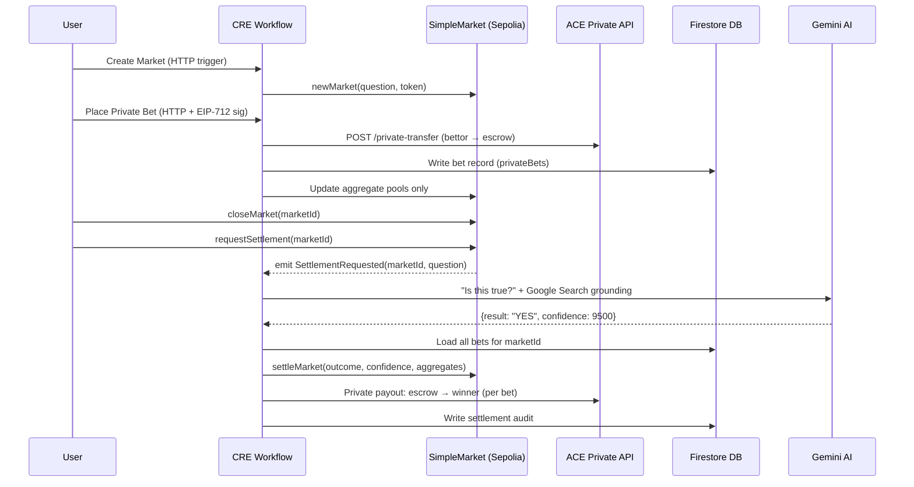

# VeritasX — AI-Powered Private Prediction Markets

> **Hackathon Tracks: Prediction Markets + Privacy**

VeritasX is a fully decentralized prediction market platform with **AI-powered settlement** and **privacy-preserving betting** built on **Chainlink CRE (Chainlink Runtime Environment)** and **Chainlink Confidential Compute**.

Users create binary prediction markets, place private bets using compliant off-chain token transfers, and have markets automatically settled by Gemini AI — all without exposing individual bet amounts, bettor identities, or payout flows on-chain.

## Why This Matters

Traditional prediction markets expose every bet on-chain: who bet, how much, and on which side. This creates front-running risks, privacy concerns, and discourages participation. VeritasX solves this by:

- **Private betting**: Individual bets are transferred via Chainlink ACE's compliant private token system — no individual bet details appear on-chain
- **Offchain bet storage**: Bet records live in Firestore, accessible only to the CRE workflow during settlement
- **AI-powered resolution**: Gemini AI with Google Search grounding determines market outcomes — no manual oracle needed
- **Private payouts**: Winners receive payouts through private token transfers from an escrow account — payout amounts and recipients stay off-chain
- **On-chain aggregates only**: The smart contract only sees pool totals (total YES/NO amounts and counts), never individual positions

## Architecture

```
┌─────────────────────────────────────────────────────────────────────────┐
│                           VeritasX Architecture                        │
├─────────────────────────────────────────────────────────────────────────┤
│                                                                         │
│  User                                                                   │
│   │                                                                     │
│   ├── 1. Create Market ──────> CRE HTTP Workflow ──> SimpleMarket.sol  │
│   │                             (createmarketworkflow.ts)               │
│   │                                                                     │
│   ├── 2. Place Private Bet ──> CRE HTTP Workflow ──> ACE Private API   │
│   │                             (privatebetworkflow.ts)   │             │
│   │                                                       ▼             │
│   │                             Firestore (privateBets) + On-chain      │
│   │                                                       aggregates    │
│   │                                                                     │
│   ├── 3. Close Market ───────> cast/ethers ──> SimpleMarket.closeMarket │
│   │                                                                     │
│   ├── 4. Request Settlement ─> cast/ethers ──> SimpleMarket             │
│   │                                            .requestSettlement       │
│   │                                             │                       │
│   │                              ┌──────────────┘                       │
│   │                              ▼ SettlementRequested event            │
│   │                                                                     │
│   └── 5. CRE Settlement Workflow (privateSettlementWorkflow.ts)        │
│          │                                                              │
│          ├── a) Gemini AI ──> Resolve YES/NO/INCONCLUSIVE              │
│          ├── b) Firestore ──> Load all private bets for market         │
│          ├── c) On-chain  ──> settleMarket with aggregates             │
│          ├── d) ACE API   ──> Private payouts to winners               │
│          └── e) Firestore ──> Write settlement audit                   │
│                                                                         │
└─────────────────────────────────────────────────────────────────────────┘
```


```mermaid
sequenceDiagram
    participant User
    participant CRE as CRE Workflow
    participant Contract as SimpleMarket (Sepolia)
    participant ACE as ACE Private API
    participant Firestore as Firestore DB
    participant Gemini as Gemini AI

    User->>CRE: Create Market (HTTP trigger)
    CRE->>Contract: newMarket(question, token)

    User->>CRE: Place Private Bet (HTTP + EIP-712 sig)
    CRE->>ACE: POST /private-transfer (bettor → escrow)
    CRE->>Firestore: Write bet record (privateBets)
    CRE->>Contract: Update aggregate pools only

    User->>Contract: closeMarket(marketId)
    User->>Contract: requestSettlement(marketId)
    Contract-->>CRE: emit SettlementRequested(marketId, question)

    CRE->>Gemini: "Is this true?" + Google Search grounding
    Gemini-->>CRE: {result: "YES", confidence: 9500}
    CRE->>Firestore: Load all bets for marketId
    CRE->>Contract: settleMarket(outcome, confidence, aggregates)
    CRE->>ACE: Private payout: escrow → winner (per bet)
    CRE->>Firestore: Write settlement audit
```

## Hackathon Track Alignment

### Prediction Markets Track

VeritasX is a decentralized prediction and forecasting application that relies on **real-world offchain data** (Gemini AI with Google Search grounding) for **automated, verifiable market resolution**:

- **Automated settlement**: CRE workflows listen for on-chain `SettlementRequested` events and autonomously resolve markets using Gemini AI
- **Verifiable outcomes**: AI confidence scores (0-10000 basis points) and Gemini response IDs are stored on-chain as evidence
- **Real-world data integration**: Gemini AI uses Google Search grounding to verify factual claims about real-world events
- **Binary markets**: Simple YES/NO outcome model with proportional payout distribution

### Privacy Track

VeritasX uses **Chainlink Confidential Compute** and **CRE's Confidential HTTP capability** to build a fully privacy-preserving prediction market:

- **Private betting via ACE**: Individual bets flow through Chainlink ACE's compliant private token transfer system — bet amounts and bettor addresses never appear on-chain
- **Confidential HTTP for API credentials**: Gemini API keys, Firebase credentials, and escrow private keys are managed through CRE's secrets system — never exposed on-chain or in logs
- **Private settlement payouts**: Winners receive payouts via private token transfers from the escrow — no payout amounts or recipient addresses visible on-chain
- **Offchain bet logic**: All bet matching, winner calculation, and payout distribution runs offchain in the CRE workflow — only aggregate totals are written to the contract
- **EIP-712 signed requests**: All private transfer operations are authenticated with EIP-712 typed data signatures for compliance
- **Shielded addresses**: The ACE API supports shielded addresses so recipients cannot be linked to real wallet addresses

**What stays private:**
- Individual bet amounts and bettor addresses
- Which side (YES/NO) each user bet on
- Winner payout amounts and recipient addresses
- API credentials and escrow keys

**What goes on-chain (aggregates only):**
- Total YES pool and NO pool sizes
- Total YES and NO bet counts
- Settlement outcome and confidence score
- Gemini response ID (evidence URI)

## Repository Structure

```
├── README.md                      # This file
├── contracts/                     # SimpleMarket.sol prediction market contract + Foundry tests/scripts
├── cre-workflow/                  # CRE project: all workflows (create, bet, settle, private settlement)
│   ├── prediction-market-demo/    # Workflow TypeScript source
│   ├── project.yaml               # Chain RPC targets
│   ├── secrets.yaml               # Secrets mapping (gitignored)
│   └── .env                       # Environment variables (gitignored)
├── private contract/              # ACE compliant private token demo (vault, token, policy engine)
├── frontend/                      # Next.js app for viewing settlement data
├── firebase-setup.md              # Firebase/Firestore configuration guide
└── firestore.rules                # Firestore security rules template
```

## Prerequisites

- **Node.js** 20+
- **Bun** (for CRE workflow bundling)
- **Foundry** (`forge`, `cast`)
- **CRE CLI** (`cre`)
- **Sepolia RPC URL** (e.g. Alchemy)
- **Wallet** funded with Sepolia ETH
- **Gemini API key**
- **Firebase project** with Firestore + Anonymous Auth enabled

## Quick Start

### 1. Environment Setup

```bash
cd cre-workflow
cp .env.example .env
```

Set these values in `.env`:

| Variable | Description |
|---|---|
| `CRE_ETH_PRIVATE_KEY` | Ethereum private key (0x-prefixed, 32 bytes) |
| `GEMINI_API_KEY_VAR` | Google Gemini API key |
| `FIREBASE_API_KEY_VAR` | Firebase Web API key |
| `FIREBASE_PROJECT_ID_VAR` | Firebase project ID |
| `ESCROW_PRIVATE_KEY_VAR` | Escrow wallet private key for payouts (0x-prefixed, 32 bytes) |

### 2. Install Dependencies

```bash
cd cre-workflow/prediction-market-demo
bun install
```

### 3. Deploy SimpleMarket Contract

```bash
cd contracts
forge install
source .env
forge script script/1_DeploySimpleMarket.s.sol --rpc-url $RPC_URL --broadcast --verify -vvvv
```

Update `config.json` with the deployed market address.

### 4. Set Up Firebase

Follow [firebase-setup.md](firebase-setup.md) to:
- Create a Firebase project
- Enable Firestore and Anonymous Auth
- Apply the security rules from `firestore.rules`

## Complete End-to-End Flow

All CRE commands run from the `cre-workflow/` directory:

```bash
cd cre-workflow
set -a && source .env && set +a
```

### Step 1: Create a Prediction Market

```bash
# Edit the question in create-market-payload.json first
cre workflow simulate ./prediction-market-demo \
  --target local-simulation \
  --trigger-index 0 \
  --http-payload "@$(pwd)/prediction-market-demo/create-market-payload.json" \
  --non-interactive \
  --broadcast
```

Payload format:
```json
{
  "question": "Will BTC close above $120,000 by Dec 31, 2026?",
  "stakingAddress": "0xdB772823f62c009E6EC805BC57A4aFc7B2701F1F",
  "tokenAddress": "0xF5655184B6bfa977FbCcD9C77d308F2d261eddBc"
}
```

### Step 2: Get the New Market ID

```bash
node --input-type=module -e "
import { JsonRpcProvider, Contract } from 'ethers';
const p = new JsonRpcProvider('https://eth-sepolia.g.alchemy.com/v2/YOUR_KEY');
const c = new Contract('0x77a8ae9Fd960a6edF8263eC0966071d86529f23c',
  ['function getMarketCount() view returns (uint256)'], p);
const n = await c.getMarketCount();
console.log('newMarketId=', Number(n) - 1);
"
```

### Step 3: Place Private Bets (YES and NO)

First, load the EIP-712 payload generator (paste into terminal):

```bash
generate_private_bet_payload() {
  local market_id="$1"
  local outcome="$2"   # YES or NO
  local out_file="$3"
  local amount_wei="${4:-1000000000000000000}"
  set -a && source .env && set +a
  MARKET_ID="$market_id" OUTCOME="$outcome" OUT_FILE="$out_file" AMOUNT_WEI="$amount_wei" \
  node --input-type=module <<'NODE'
import fs from "node:fs";
import { Wallet } from "ethers";
const req = (v, k) => { if (!v) throw new Error(k + " required"); return String(v).trim(); };
const wallet = new Wallet(req(process.env.CRE_ETH_PRIVATE_KEY, "CRE_ETH_PRIVATE_KEY"));
const marketId = Number(req(process.env.MARKET_ID, "MARKET_ID"));
const outcome = req(process.env.OUTCOME, "OUTCOME").toUpperCase();
if (outcome !== "YES" && outcome !== "NO") throw new Error("OUTCOME must be YES or NO");
const recipient = process.env.ESCROW_ADDRESS ?? "0xdB772823f62c009E6EC805BC57A4aFc7B2701F1F";
const token = process.env.TOKEN_ADDRESS ?? "0xF5655184B6bfa977FbCcD9C77d308F2d261eddBc";
const amount = process.env.AMOUNT_WEI ?? "1000000000000000000";
const timestamp = Math.floor(Date.now() / 1000);
const domain = { name: "CompliantPrivateTokenDemo", version: "0.0.1", chainId: 11155111,
  verifyingContract: "0xE588a6c73933BFD66Af9b4A07d48bcE59c0D2d13" };
const types = { "Private Token Transfer": [
  { name: "sender", type: "address" }, { name: "recipient", type: "address" },
  { name: "token", type: "address" }, { name: "amount", type: "uint256" },
  { name: "flags", type: "string[]" }, { name: "timestamp", type: "uint256" }
]};
const message = { sender: wallet.address, recipient, token, amount, flags: [], timestamp };
const auth = await wallet.signTypedData(domain, types, message);
const payload = { marketId, outcome, amount, account: wallet.address, recipient,
  tokenAddress: token, flags: [], timestamp, auth };
fs.writeFileSync(req(process.env.OUT_FILE, "OUT_FILE"), JSON.stringify(payload, null, 2));
console.log(JSON.stringify(payload, null, 2));
NODE
}
```

Generate and broadcast bets:

```bash
# Generate YES bet payload
generate_private_bet_payload <MARKET_ID> YES ./prediction-market-demo/private-bet-payload-yes.json

# Generate NO bet payload
generate_private_bet_payload <MARKET_ID> NO ./prediction-market-demo/private-bet-payload-no.json

# Broadcast YES bet (private transfer + Firestore write + on-chain aggregate)
cre workflow simulate ./prediction-market-demo \
  --target private-bet-local-simulation \
  --trigger-index 0 \
  --http-payload "@$(pwd)/prediction-market-demo/private-bet-payload-yes.json" \
  --non-interactive \
  --broadcast

# Broadcast NO bet
cre workflow simulate ./prediction-market-demo \
  --target private-bet-local-simulation \
  --trigger-index 0 \
  --http-payload "@$(pwd)/prediction-market-demo/private-bet-payload-no.json" \
  --non-interactive \
  --broadcast
```

### Step 4: Close the Market

```bash
node --input-type=module -e "
import { Wallet, JsonRpcProvider, Contract } from 'ethers';
const marketId = <MARKET_ID>n;
const provider = new JsonRpcProvider('https://eth-sepolia.g.alchemy.com/v2/YOUR_KEY');
const wallet = new Wallet(process.env.CRE_ETH_PRIVATE_KEY, provider);
const market = new Contract('0x77a8ae9Fd960a6edF8263eC0966071d86529f23c',
  ['function closeMarket(uint256)'], wallet);
const tx = await market.closeMarket(marketId);
console.log('closeMarketTx=', tx.hash);
await tx.wait();
"
```

### Step 5: Request Settlement

```bash
node --input-type=module -e "
import { Wallet, JsonRpcProvider, Contract } from 'ethers';
const marketId = <MARKET_ID>n;
const provider = new JsonRpcProvider('https://eth-sepolia.g.alchemy.com/v2/YOUR_KEY');
const wallet = new Wallet(process.env.CRE_ETH_PRIVATE_KEY, provider);
const market = new Contract('0x77a8ae9Fd960a6edF8263eC0966071d86529f23c',
  ['function requestSettlement(uint256)'], wallet);
const tx = await market.requestSettlement(marketId);
console.log('requestSettlementTx=', tx.hash);
await tx.wait();
"
```

**Save the `requestSettlementTx` hash** — you need it for the next step.

### Step 6: Run the Private Settlement Workflow

This is the core CRE workflow that does everything automatically:

```bash
# Simulate first (dry run)
cre workflow simulate ./prediction-market-demo \
  --target staging \
  --evm-tx-hash <REQUEST_SETTLEMENT_TX_HASH> \
  --evm-event-index 0 \
  --trigger-index 0 \
  --non-interactive

# Broadcast (execute for real)
cre workflow simulate ./prediction-market-demo \
  --target staging \
  --evm-tx-hash <REQUEST_SETTLEMENT_TX_HASH> \
  --evm-event-index 0 \
  --trigger-index 0 \
  --non-interactive \
  --broadcast
```

The CRE workflow automatically:
1. Detects the `SettlementRequested` event
2. Queries Gemini AI to resolve the market question
3. Loads all private bets from Firestore
4. Settles the market on-chain with aggregate totals
5. Executes private payouts to winners via ACE API
6. Writes a settlement audit to Firestore

### Step 7: Verify Settlement

```bash
# Check on-chain market state
node --input-type=module -e "
import { JsonRpcProvider, Contract } from 'ethers';
const p = new JsonRpcProvider('https://eth-sepolia.g.alchemy.com/v2/YOUR_KEY');
const c = new Contract('0x77a8ae9Fd960a6edF8263eC0966071d86529f23c',
  ['function getMarket(uint256) view returns (string,uint256,uint256,uint8,uint8,uint256,string,uint16,uint256[2],uint256[2])'],
  p);
const m = await c.getMarket(<MARKET_ID>n);
console.log('question:', m[0]);
console.log('status:', ['Open','SettlementRequested','Settled','NeedsManual'][Number(m[3])]);
console.log('outcome:', ['None','No','Yes','Inconclusive'][Number(m[4])]);
console.log('confidence:', Number(m[7]));

const c2 = new Contract('0x77a8ae9Fd960a6edF8263eC0966071d86529f23c',
  ['function getPoolSizes(uint256) view returns (uint256,uint256,uint256,uint256)'], p);
const pools = await c2.getPoolSizes(<MARKET_ID>n);
console.log('noTotal:', pools[0].toString(), 'yesTotal:', pools[1].toString());
console.log('noCount:', pools[2].toString(), 'yesCount:', pools[3].toString());
"
```

## CRE Workflow Targets

| Target | Workflow | Trigger | Description |
|---|---|---|---|
| `local-simulation` | `createmarketworkflow.ts` | HTTP | Create new prediction market |
| `private-bet-local-simulation` | `privatebetworkflow.ts` | HTTP | Place private bet (ACE transfer + Firestore + on-chain aggregate) |
| `staging` | `privateSettlementWorkflow.ts` | EVM Log | Full settlement: Gemini + settle + private payouts |
| `private-settlement-local-simulation` | `privateSettlementWorkflow.ts` | EVM Log | Same settlement workflow (local sim target) |
| `private-settlement-staging` | `privateSettlementWorkflow.ts` | EVM Log | Same settlement workflow (staging target) |

## CRE Capabilities Demonstrated

| CRE Capability | How We Use It |
|---|---|
| **EVM Log Trigger** | Listen for `SettlementRequested` events to auto-trigger settlement |
| **HTTP Capability** | Call Gemini AI, Firestore REST API, and ACE Private Transfer API |
| **EVM Write (Report)** | Submit signed settlement reports to the smart contract |
| **Secrets Management** | Securely store Gemini API key, Firebase credentials, escrow private key |
| **Consensus Aggregation** | Ensure all CRE nodes agree on Gemini response before settlement |
| **Confidential HTTP** | API credentials and request/response data protected from on-chain exposure |

## Key Smart Contract: SimpleMarket.sol

**Market Lifecycle:**

```
Open → SettlementRequested → Settled (or NeedsManual → Settled)
```

**Key Functions:**
- `newMarket(question, token)` — Create a binary prediction market
- `makePrediction(marketId, outcome, amount)` — Stake tokens on YES or NO (public path)
- `closeMarket(marketId)` — Close market for new predictions
- `requestSettlement(marketId)` — Emit `SettlementRequested` event for CRE
- `onReport(report)` — Receive CRE settlement report with outcome + confidence
- `settleMarketManually(marketId, outcome)` — Manual override for INCONCLUSIVE results
- `claimPrediction(marketId)` — Winners claim proportional payouts

## Key Addresses (Sepolia Testnet)

| Contract | Address |
|---|---|
| SimpleMarket | `0x77a8ae9Fd960a6edF8263eC0966071d86529f23c` |
| ACE Vault | `0xE588a6c73933BFD66Af9b4A07d48bcE59c0D2d13` |
| Private Token (demo) | `0xF5655184B6bfa977FbCcD9C77d308F2d261eddBc` |
| Staking/Escrow Address | `0xdB772823f62c009E6EC805BC57A4aFc7B2701F1F` |
| CRE Forwarder (Sepolia) | `0xF8344CFd5c43616a4366C34E3EEE75af79a74482` |

## Documentation Map

### Core Docs
- [CRE Workflow README](cre-workflow/README.md) — CRE workflow architecture, module deep-dive, all three workflows explained
- [Contracts README](contracts/README.md) — SimpleMarket smart contract, tests, Foundry deployment scripts
- [Private Contract README](private%20contract/README.md) — ACE compliant private token demo (vault, deposit, transfer, withdraw)
- [Private Contract API Instructions](private%20contract/API%20Instructions.md) — ACE API reference and demo UI links
- [Firebase Setup Guide](firebase-setup.md) — Firebase project creation, Firestore, anonymous auth, security rules
- [Frontend README](frontend/README.md) — Next.js app for viewing settlement data from Firestore

### Workflow Guides
- [Workflow Commands](cre-workflow/prediction-market-demo/workflow-commands.md) — Complete command reference for every step (create, bet, close, settle, verify)
- [Workflow Runbook](cre-workflow/prediction-market-demo/workflow-runbook.md) — Quick condensed operational guide
- [Private Bet Workflow](cre-workflow/prediction-market-demo/private-bet-workflow.md) — Private bet flow: ACE transfer + Firestore + on-chain aggregate
- [Private Settlement Workflow](cre-workflow/prediction-market-demo/private-settlement-workflow.md) — Settlement flow: Gemini AI + on-chain settle + private payouts

## Tech Stack

- **Chainlink CRE** — Workflow orchestration, EVM triggers, HTTP capabilities, secrets, consensus
- **Chainlink ACE** — Compliant private token transfers (privacy-preserving betting and payouts)
- **Google Gemini AI** — Market outcome resolution with Google Search grounding
- **Firebase/Firestore** — Offchain bet storage and settlement audit trail
- **Solidity + Foundry** — SimpleMarket prediction market contract on Sepolia
- **Viem** — ABI encoding, EIP-712 typed data hashing
- **Pure BigInt secp256k1** — Custom ECDSA signing implementation for WASM-compatible CRE execution
- **EIP-712** — Typed structured data signing for all private transfer authentication
- **Next.js** — Frontend for viewing settlement data

## Safety Notes

- Do not commit real private keys or API keys
- Use testnet funds/accounts only
- This repo is demo/hackathon-oriented and not production-hardened
- All private transfers are compliance-checked via Chainlink ACE PolicyEngine
