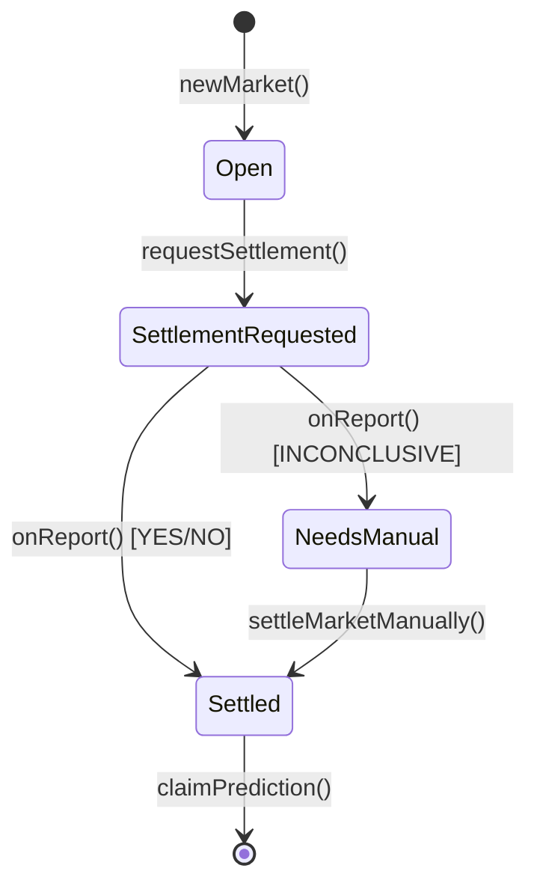

# Contracts Directory

This directory contains a Foundry project implementing a binary prediction market smart contract (`SimpleMarket.sol`) that integrates with Chainlink Runtime Environment (CRE) for automated AI-powered settlement.

## Table of Contents

- [Overview](#overview)
- [Dependencies](#dependencies)
- [SimpleMarket.sol Contract](#simplemarketsol-contract)
  - [Architecture](#architecture)
  - [Market Lifecycle](#market-lifecycle)
  - [Key Features](#key-features)
- [Testing](#testing)
  - [Test Coverage](#test-coverage)
  - [Running Tests](#running-tests)
- [Scripts](#scripts)
  - [Script Overview](#script-overview)
  - [Script Setup](#script-setup)
  - [Script Execution](#script-execution)

## Overview

The contracts directory is a standard Foundry project containing:

- **Smart Contract**: `SimpleMarket.sol` - A binary prediction market with CRE integration
- **Tests**: Comprehensive test suite covering all contract functionality
- **Scripts**: Forge scripts for end-to-end deployment and interaction
- **Interfaces**: Supporting interfaces for CRE receiver pattern
- **Mock Contracts**: Mock ERC-20 token (USDC) for testing

## Dependencies

The project uses the following dependencies:

- **Foundry/Forge**: Smart contract development framework
- **OpenZeppelin Contracts**: `ERC20`, `SafeERC20` for token operations
- **Forge Standard Library**: Testing utilities and console logging

### Installing Dependencies

```bash
# Install forge dependencies
forge install

# Update dependencies
forge update
```

### Dependency Remappings

Configured in `foundry.toml`:

```toml
remappings = [
    "@openzeppelin/=lib/openzeppelin-contracts/"
]
```

## SimpleMarket.sol Contract

Located at `src/SimpleMarket.sol`, this contract implements a minimal binary prediction market that allows users to stake ERC-20 tokens on Yes/No outcomes and uses CRE to automatically settle markets via AI.

### Architecture

The contract inherits from `ReceiverTemplate`, which provides the interface for receiving signed settlement reports from CRE workflows.

**Key Components:**

- **Enums**:

  - `Outcome`: Represents market outcomes (`None`, `No`, `Yes`, `Inconclusive`)
  - `Status`: Represents market lifecycle states (`Open`, `SettlementRequested`, `Settled`, `NeedsManual`)

- **Structs**:

  - `Market`: Contains question, timestamps, status, outcome, confidence scores, and pool data
  - `Prediction`: Tracks individual user predictions (amount, outcome, claimed status)

- **State Variables**:
  - `nextMarketId`: Counter for market IDs
  - `markets`: Mapping of market ID to Market data
  - `predictions`: Nested mapping of market ID → user address → Prediction
  - `paymentToken`: Immutable ERC-20 token address (typically USDC)

### Market Lifecycle



1. **Market Creation** (`newMarket`): Creates a new market with a 3-minute prediction window
2. **Prediction Phase** (`makePrediction`): Users stake tokens on Yes or No outcomes
3. **Settlement Request** (`requestSettlement`): Called after market closes, emits event for CRE
4. **Automated Settlement** (`onReport`): CRE calls this with Gemini AI's decision
5. **Manual Settlement** (`settleMarketManually`): Fallback for inconclusive results
6. **Claim Rewards** (`claimPrediction`): Winners claim proportional payouts

### Key Features

- **Binary Outcomes**: Simple Yes/No prediction model
- **ERC-20 Token Stakes**: Uses any ERC-20 token (configured at deployment)
- **CRE Integration**: Receives cryptographically signed settlement reports
- **Proportional Payouts**: Winners split the total pool based on their stake
- **Confidence Tracking**: Stores AI confidence scores (0-10000 basis points)
- **Evidence URI**: Records Gemini response IDs for auditing
- **Manual Override**: Allows operator intervention for inconclusive results
- **Access Control**: Owner-managed forwarder address and workflow validation

### Access Control & Security

The contract implements multiple layers of access control:

1. **Forwarder Restriction**: Only the configured `s_forwarderAddress` (set in constructor) can call `onReport()` to settle markets
2. **Owner Controls**: The contract owner (deployer) can update:
   - `s_expectedAuthor`: Expected workflow owner author for validation
   - `s_expectedWorkflowName`: Expected workflow name for validation
   - `s_expectedWorkflowId` : Expected workflow ID for validation 
   - `s_forwarderAddress` : CRE forwarder address (can be updated after deployment)
3. **Manual Override**: The owner can manually settle inconclusive markets using `settleMarketManually()`

**Access Control Functions (inherited from ReceiverTemplate):**
- `setExpectedAuthor(address)` - Update expected workflow author
- `setExpectedWorkflowName(string)` - Update expected workflow name
- `setExpectedWorkflowId(bytes32)` - Update expected workflow ID
- `setForwarderAddress(address)` - Update CRE forwarder address (initially set in constructor)
- `transferOwnership(address)` - Transfer contract ownership (from OpenZeppelin Ownable)

## Testing

Located at `test/SimpleMarket.t.sol`, the test suite uses Foundry's testing framework with comprehensive coverage of all contract functionality.

### Test Coverage

The test suite covers:

**Market Creation:**

- ✅ Correct field initialization
- ✅ Sequential market ID assignment
- ✅ Timestamp validation

**Predictions:**

- ✅ Token transfers and approval
- ✅ Per-side totals and counts
- ✅ Duplicate prediction prevention
- ✅ Invalid outcome rejection
- ✅ Market timing enforcement

**Settlement Requests:**

- ✅ Event emission
- ✅ Status transitions
- ✅ Timing constraints
- ✅ Duplicate request prevention

**Settlement Execution:**

- ✅ CRE report processing via `onReport()`
- ✅ Outcome and confidence recording
- ✅ Evidence URI storage
- ✅ Status transitions (Settled vs NeedsManual)

**Manual Settlement:**

- ✅ Inconclusive outcome handling
- ✅ Manual finalization flow
- ✅ Invalid outcome rejection
- ✅ Status gating

**Claims & Payouts:**

- ✅ Single winner scenarios
- ✅ Proportional split calculations
- ✅ Incorrect prediction rejection
- ✅ Duplicate claim prevention
- ✅ No-winner scenarios
- ✅ Pre-settlement claim prevention

### Running Tests

```bash
# Install dependencies
forge install

# Run all tests
forge test

# Run with verbosity
forge test -vvv

# Run specific test
forge test --match-test test_claim_proportionalSplit_multipleWinners

# Generate gas report
forge test --gas-report

# Generate coverage report
forge coverage
```

## Scripts

The `script/` directory contains Forge scripts for additional execution options. For a complete end to end walkthrough, see the [quick start](../README.md#quick-start).

### Script Overview

| Script                       | Purpose            | Key Actions                                        |
| ---------------------------- | ------------------ | -------------------------------------------------- |
| `1_DeploySimpleMarket.s.sol` | Deploy contract    | Deploys SimpleMarket with configured payment token |
| `2_CreateNewMarket.s.sol`    | Create market      | Calls `newMarket()` with a question                |
| `3_MakePrediction.s.sol`     | Place bet          | Approves tokens and calls `makePrediction()`       |
| `4_RequestSettlement.s.sol`  | Request settlement | Calls `requestSettlement()` (emits event for CRE)  |
| `5_ClaimPrediction.s.sol`    | Claim winnings     | Calls `claimPrediction()` for winners              |
| `SettleMarketManually.s.sol` | Manual override    | Calls `settleMarketManually()` if needed           |

### Script Setup

Create a `.env` file in the `contracts/` directory:

```bash
cp .env.example .env
source .env
```

Inside of the new `.env` file, set the following values.

- ETH private key
- ETH Sepolia RPC URL

You will populate the remaining `.env` variables in the following steps.

**Note:** The CRE forwarder address is set in the constructor during deployment. The address `0xF8344CFd5c43616a4366C34E3EEE75af79a74482` is used for ETH Sepolia testnet. It can be updated later using `setForwarderAddress()` if needed.

### Script Execution

#### 1. Deploy SimpleMarket

Deploys a new instance of the SimpleMarket contract with the payment token.

```bash
#Load .env values
source .env

#Deploy SimpleMarket
forge script script/1_DeploySimpleMarket.s.sol \
  --rpc-url $RPC_URL \
  --broadcast \
  --verify \
  -vvvv
```

**Output**: Note the contract address and set it as `MARKET` in your `.env`.

#### 2. Create a New Market

Creates a market with a binary question. Edit the question in the script file before running.

```bash
forge script script/2_CreateNewMarket.s.sol \
  --rpc-url $RPC_URL \
  --broadcast \
  -vvvv
```

**Output**: Note the market ID and set it as `MARKET_ID` in your `.env`.

**⚠️ Note**: The market has a 3-minute prediction window. Complete the next step quickly!

#### 3. Make a Prediction

Place a bet on the market. Set `OUTCOME` (1=No, 2=Yes) and `AMOUNT` in `.env` first.

```bash
forge script script/3_MakePrediction.s.sol \
  --rpc-url $RPC_URL \
  --broadcast \
  -vvvv
```

**Prerequisites**:

- Your account must have sufficient USDC balance. This script also approves `SimpleMarket` to spend your USDC when making your prediction.
- Execute within 3 minutes of market creation (Market close is set to 3 minutes by default in `src/SimpleMarket.sol`)
- Set `OUTCOME` and `AMOUNT` in `.env`

#### 4. Request Settlement

Request CRE to settle the market (must be after market close time).

```bash
forge script script/4_RequestSettlement.s.sol \
  --rpc-url $RPC_URL \
  --broadcast \
  -vvvv
```

**Output**: Note the transaction hash for CRE simulation.

**This emits the `SettlementRequested` event that triggers the CRE workflow!**

#### 5. CRE Settlement

At this point, the CRE workflow (in `cre-workflow/`) will:

1. Detect the `SettlementRequested` event
2. Query Gemini AI for the outcome
3. Submit a signed settlement report via `onReport()`

See the [quickstart section](../README.md#quick-start) for details on running the CRE workflow. Note down the contract address of your deployed market and the transaction hash associated with the SettlementRequested event emitted by step 4. Use these values when configuring your `cre-workflow`.

#### 6. Claim Prediction

After the market is settled, winners can claim their rewards.

```bash
forge script script/5_ClaimPrediction.s.sol \
  --rpc-url $RPC_URL \
  --broadcast \
  -vvvv
```

**Prerequisites**:

- Market must be settled (status = `Settled`)
- Your prediction must match the winning outcome

#### 7. Manual Settlement (Optional)

If the LLM returns `INCONCLUSIVE`, use this script to manually settle.

```bash
# Set OUTCOME in .env first
forge script script/SettleMarketManually.s.sol \
  --rpc-url $RPC_URL \
  --broadcast \
  -vvvv
```

**Prerequisites**: Market status must be `NeedsManual`.

## Interacting with Deployed Contracts

You can interact with deployed contracts using `cast`:

### Query Market Data

```bash
# Get market details
cast call $MARKET "getMarket(uint256)(string,uint256,uint256,uint8,uint8,uint256,string,uint16,uint256[2],uint256[2])" $MARKET_ID --rpc-url $RPC_URL

# Get your prediction
cast call $MARKET "getPrediction(uint256)(uint256,uint8,bool)" $MARKET_ID --rpc-url $RPC_URL

# Get evidence URI
cast call $MARKET "getUri(uint256)(string)" $MARKET_ID --rpc-url $RPC_URL
```