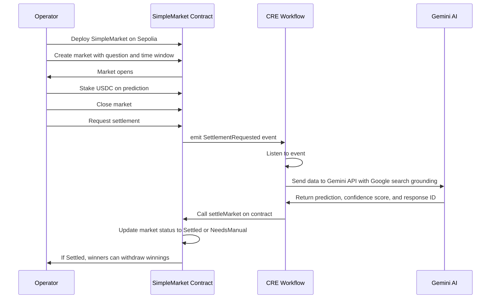

# CRE Workflow

This directory contains a Chainlink Runtime Environment (CRE) project that automatically settles prediction markets using Gemini AI and stores settlement data in Firestore.

## Table of Contents

- [Overview](#overview)
- [Project Structure](#project-structure)
- [How the Workflow Works](#how-the-workflow-works)
  - [Workflow Flow Diagram](#workflow-flow-diagram)
  - [Step-by-Step Process](#step-by-step-process)
- [File Organization](#file-organization)
  - [Core Files](#core-files)
  - [Configuration Files](#configuration-files)
- [Module Deep Dive](#module-deep-dive)
  - [main.ts](#maints)
  - [gemini.ts](#geminits)
  - [evm.ts](#evmts)
  - [firebase.ts](#firebasets)
  - [types.ts](#typests)
- [CRE Capabilities Used](#cre-capabilities-used)
- [Troubleshooting](#troubleshooting)

## Overview

The CRE workflow automates the settlement of prediction markets by:

1. **Listening** for `SettlementRequested` events from the `SimpleMarket` contract
2. **Querying** Google's Gemini AI to determine the factual outcome of the market question
3. **Settling** the market on-chain by submitting a cryptographically signed report
4. **Storing** settlement data in a Firestore database for audit and frontend display

This workflow demonstrates  key CRE triggers and capabilities:
- **EVM Log Trigger**: Event-driven execution
- **HTTP Capability**: External API calls (Gemini, Firestore)
- **EVM Write Capability**: Signed transaction submission

## Project Structure

```
cre-workflow/
├── prediction-market-demo/      # Main workflow directory
│   ├── main.ts                  # Workflow entry point and log trigger handler
│   ├── gemini.ts                # Gemini AI integration
│   ├── evm.ts                   # EVM settlement logic
│   ├── firebase.ts              # Firestore database integration
│   ├── types.ts                 # TypeScript types and Zod schemas
│   ├── config.json              # Workflow configuration
│   ├── workflow.yaml            # CRE workflow settings
│   ├── package.json             # Dependencies
│   └── node_modules/            # Installed packages
├── project.yaml                 # CRE project settings (RPC endpoints)
├── secrets.yaml                 # Secrets configuration (gitignored)
└── sample.env                   # Environment variable template
```

## How the Workflow Works

### Workflow Flow Diagram



### Step-by-Step Process

1. **Event Detection**: CRE monitors Sepolia for `SettlementRequested` events from configured market addresses
2. **Log Parsing**: Extract `marketId` and `question` from the event using `viem`'s `decodeEventLog`
3. **AI Query**: Send question to Gemini AI with structured prompt and Google search grounding
4. **Response Validation**: Parse and validate JSON response using Zod schema
5. **Report Signing**: Encode outcome data and sign with CRE's ECDSA key
6. **On-Chain Settlement**: Submit signed report to contract's `onReport()` function
7. **Firestore Write**: Store settlement details for audit trail and frontend display

## File Organization

### Core Files

All workflow logic is contained within the `prediction-market-demo/` directory:

| File | Purpose | Key Exports |
|------|---------|-------------|
| `main.ts` | Workflow entry point | `main()`, `onLogTrigger()`, `initWorkflow()` |
| `gemini.ts` | Gemini AI integration | `askGemini()`, `PostGeminiData()` |
| `evm.ts` | EVM settlement logic | `settleMarket()`, encoding/signing helpers |
| `firebase.ts` | Firestore integration | `writeToFirestore()`, authentication flow |
| `types.ts` | Type definitions | Zod schemas, TypeScript types |

### Configuration Files

| File | Purpose | Location |
|------|---------|----------|
| `config.json` | Workflow configuration | `prediction-market-demo/` |
| `workflow.yaml` | CRE workflow settings | `prediction-market-demo/` |
| `project.yaml` | CRE project settings | `cre-workflow/` (parent) |
| `secrets.yaml` | Secret values | `cre-workflow/` (parent, gitignored) |
| `.env` | Environment variables | `cre-workflow/` (parent, gitignored) |

## Module Deep Dive

### main.ts

**Purpose**: Workflow entry point and log trigger handler.

**Key Functions:**

- `main()`: Initializes CRE runner and starts workflow
- `initWorkflow(config)`: Sets up EVM client and log trigger
- `onLogTrigger(runtime, log)`: Handles `SettlementRequested` events

**Event Handling:**
```typescript
const eventAbi = parseAbi([
  "event SettlementRequested(uint256 indexed marketId, string question)"
]);

// Compute event signature hash
const requestSettlementHash = keccak256(toHex("SettlementRequested(uint256,string)"));

// Register log trigger
evmClient.logTrigger({
  addresses: [config.evms[0].marketAddress],
  topics: [{ values: [requestSettlementHash] }],
  confidence: "CONFIDENCE_LEVEL_FINALIZED"
})
```

**Orchestration Flow:**
1. Decode event log → extract `marketId` and `question`
2. Call `askGemini()` → get AI response
3. Call `settleMarket()` → submit on-chain settlement
4. Call `writeToFirestore()` → store audit data

### gemini.ts

**Purpose**: Gemini AI integration with structured JSON output.

**Key Functions:**

- `askGemini(runtime, marketId, question)`: Main entry point
- `PostGeminiData(logDetails, apiKey)`: Builds HTTP request with CRE HTTP Capability

**Prompt Engineering:**

The `systemPrompt` is carefully designed to:
- Treat questions as untrusted input (ignore embedded instructions)
- Return strict JSON schema: `{result: "YES"|"NO"|"INCONCLUSIVE", confidence: 0-10000}`
- Use Google search grounding for factual verification
- Output minified JSON (no markdown, no backticks)

**HTTP Request:**
```typescript
const req = {
  url: `https://generativelanguage.googleapis.com/v1beta/models/${config.geminiModel}:generateContent`,
  method: "POST",
  body: base64EncodedJson,
  headers: {
    "Content-Type": "application/json",
    "x-goog-api-key": geminiApiKey
  }
};
```

**Aggregation**: Uses `consensusIdenticalAggregation()` to ensure all CRE nodes agree on the Gemini response.

### evm.ts

**Purpose**: On-chain settlement logic using CRE's EVM Write capability.

**Key Functions:**

- `settleMarket(runtime, marketId, outcomeJson, responseId)`: Main settlement function
- `mapOutcomeToUint(result)`: Maps "YES"/"NO"/"INCONCLUSIVE" to 1/2/3
- `makeReportData(...)`: ABI-encodes report payload

**Settlement Flow:**

1. **Validate** Gemini response with Zod schema
2. **Map** outcome string to uint8 (1=NO, 2=YES, 3=INCONCLUSIVE)
3. **Encode** report data: `(uint256 marketId, uint8 outcome, uint16 confidence, string responseId)`
4. **Sign** report using CRE's ECDSA key over keccak256 hash
5. **Submit** signed report via `evmClient.writeReport()`

**ABI Encoding:**
```typescript
const reportData = encodeAbiParameters(
  parseAbiParameters("uint256 marketId, uint8 outcome, uint16 confidenceBp, string responseId"),
  [marketId, outcomeUint, parsed.confidence, responseId]
);
```

**Signing:**
```typescript
const reportResponse = runtime.report({
  encodedPayload: hexToBase64(reportData),
  encoderName: "evm",
  signingAlgo: "ecdsa",
  hashingAlgo: "keccak256"
}).result();
```

### firebase.ts

**Purpose**: Firestore database integration for audit trail.

**Key Functions:**

- `writeToFirestore(runtime, response, txHash)`: Main entry point
- `postFirebaseIdToken(firebaseApiKey)`: Obtains Firebase ID token
- `postFirestoreWrite(idToken, projectId, response, txHash)`: Writes document

**Authentication Flow:**

1. Call Firebase Auth `signUp` endpoint to get ID token
2. Use ID token as Bearer authorization for Firestore API

**Document Structure:**
```typescript
{
  fields: {
    statusCode: { integerValue: 200 },
    geminiResponse: { stringValue: '{"result":"YES","confidence":10000}' },
    responseId: { stringValue: "abc123..." },
    rawJsonString: { stringValue: "..." },
    txHash: { stringValue: "0x..." },
    createdAt: { integerValue: 1698765432000 }
  }
}
```

**Document ID**: Uses Gemini's `responseId` as the Firestore document ID.

### types.ts

**Purpose**: TypeScript types and Zod validation schemas.

**Key Schemas:**

- `configSchema`: Validates workflow configuration
- `GeminiResponseSchema`: Validates Gemini AI output
  ```typescript
  z.object({
    result: z.enum(["YES", "NO", "INCONCLUSIVE"]),
    confidence: z.number().int().min(0).max(10_000)
  })
  ```

**Key Types:**

- `Config`: Workflow configuration
- `GeminiResponse`: HTTP response from Gemini
- `LLMResult`: Validated AI result
- `FirestoreWriteData`: Firestore document structure

## CRE Capabilities Used

This workflow demonstrates all three core CRE capabilities:

| Capability | Usage | Code Location |
|------------|-------|---------------|
| **EVM Log Trigger** | Listen for `SettlementRequested` events | `main.ts` - `evmClient.logTrigger()` |
| **HTTP Capability** | Call Gemini API, Firestore API | `gemini.ts`, `firebase.ts` - `httpClient.sendRequest()` |
| **EVM Write Capability** | Submit signed settlement report | `evm.ts` - `evmClient.writeReport()` |

**Additional Features:**
- **Secrets Management**: Secure API key storage and retrieval
- **Consensus Aggregation**: Identical response requirement across nodes
- **Event Decoding**: ABI-based log parsing with `viem`
- **Report Signing**: ECDSA signatures over keccak256 hashes

## Troubleshooting

### Common Issues

**Issue**: `Network not found for chain selector name`
- **Solution**: Ensure `chainSelectorName` in `config.json` matches a supported CRE chain

**Issue**: `HTTP request failed with status: 401`
- **Solution**: Verify your API keys in `.env` and `secrets.yaml`

**Issue**: `Malformed LLM response: missing candidates[0].content.parts[0].text`
- **Solution**: Check Gemini API quota and model availability

**Issue**: Transaction fails with insufficient gas
- **Solution**: Increase `gasLimit` in `config.json`

**Issue**: Firestore write fails with `PERMISSION_DENIED`
- **Solution**: Check Firestore security rules allow anonymous writes (see [firebase-setup.md](../firebase-setup.md))

### Debugging Tips

1. **Increase verbosity**: Add more `runtime.log()` calls
2. **Check RPC connectivity**: Test RPC URL in `project.yaml`
3. **Validate secrets**: Ensure environment variables are set correctly
4. **Test Gemini API**: Use Gemini's web playground to verify prompt behavior
5. **Inspect on-chain state**: Use `cast` to read contract state after settlement

### Viewing Logs

CRE logs are prefixed with `[USER LOG]` for user-generated logs:

```
[USER LOG] Settlement request detected for Market Id: 0
[USER LOG] Gemini Response for market: {"result":"YES","confidence":9500}
```

System logs provide additional context about HTTP requests and blockchain operations.

## Next Steps

- Review the [contracts README](../contracts/README.md) for on-chain integration
- Check the [firebase-setup guide](../firebase-setup.md) for Firestore configuration
- Explore the [root README](../README.md) for end-to-end workflow
- Consult [CRE Documentation](https://docs.chain.link/) for advanced features

