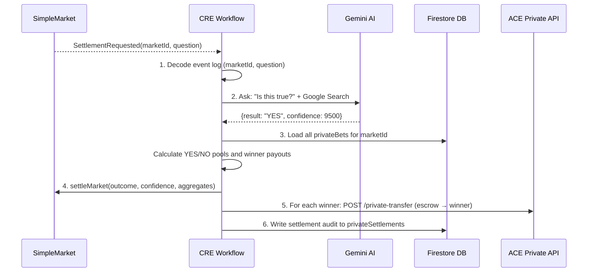

# CRE Workflows — VeritasX Prediction Market

This directory contains all **Chainlink Runtime Environment (CRE)** workflows that power the VeritasX prediction market system. The workflows handle market creation, private betting, AI-powered settlement, and privacy-preserving payouts.

## Table of Contents

- [Overview](#overview)
- [Workflows](#workflows)
- [Project Structure](#project-structure)
- [Private Settlement Workflow (Core)](#private-settlement-workflow-core)
- [Private Bet Workflow](#private-bet-workflow)
- [Create Market Workflow](#create-market-workflow)
- [CRE Capabilities Used](#cre-capabilities-used)
- [Configuration](#configuration)
- [Module Deep Dive](#module-deep-dive)
- [Troubleshooting](#troubleshooting)

## Overview

VeritasX uses three CRE workflows that together implement a privacy-preserving prediction market:

1. **Create Market** — HTTP-triggered workflow to deploy new prediction markets on-chain
2. **Private Bet** — HTTP-triggered workflow that executes private token transfers (via ACE API), writes bet records to Firestore, and updates on-chain aggregate pools
3. **Private Settlement** — EVM log-triggered workflow that resolves markets using Gemini AI, settles on-chain, and pays winners privately

All workflows compile to WASM via Bun + Javy (QuickJS) and execute inside the CRE decentralized compute environment.

## Workflows

| Workflow | File | Trigger | What It Does |
|---|---|---|---|
| Create Market | `createmarketworkflow.ts` | HTTP | Creates a new prediction market on SimpleMarket contract |
| Private Bet | `privatebetworkflow.ts` | HTTP | Private transfer → Firestore bet record → On-chain aggregate update |
| Private Settlement | `privateSettlementWorkflow.ts` | EVM Log (`SettlementRequested`) | Gemini AI resolution → On-chain settle → Private payouts → Audit |

## Project Structure

```
cre-workflow/
├── prediction-market-demo/
│   ├── createmarketworkflow.ts          # Market creation workflow
│   ├── privatebetworkflow.ts            # Private bet workflow
│   ├── privateBetEvm.ts                 # On-chain aggregate update for bets
│   ├── privateBetFirestore.ts           # Firestore bet record writes
│   ├── privateBetHttpCallback.ts        # HTTP callback for bet workflow
│   ├── privateBetTypes.ts               # Types for bet workflow
│   ├── privateTransferApi.ts            # ACE API client for bet transfers
│   ├── privateSettlementWorkflow.ts     # ★ Main settlement workflow
│   ├── privateSettlementGemini.ts       # Gemini AI integration
│   ├── privateSettlementEvm.ts          # On-chain settlement logic
│   ├── privateSettlementFirestore.ts    # Firestore bet reads + audit writes
│   ├── privateSettlementPayout.ts       # Private payout execution (pure BigInt secp256k1)
│   ├── privateSettlementTypes.ts        # Types for settlement workflow
│   ├── main.ts                          # Standard (non-private) settlement workflow
│   ├── gemini.ts                        # Gemini integration for standard settlement
│   ├── evm.ts                           # EVM logic for standard settlement
│   ├── firebase.ts                      # Firebase for standard settlement
│   ├── httpCallback.ts                  # HTTP callback helpers
│   ├── types.ts                         # Types for standard settlement
│   ├── config.json                      # Workflow configuration
│   ├── workflow.yaml                    # CRE target definitions
│   └── package.json                     # Dependencies
├── project.yaml                         # Chain RPC endpoints per target
├── secrets.yaml                         # Secrets mapping (secret name → env var)
└── .env                                 # Environment variables (gitignored)
```

## Private Settlement Workflow (Core)

The private settlement workflow (`privateSettlementWorkflow.ts`) is the heart of VeritasX. It is triggered by a `SettlementRequested(uint256 indexed marketId, string question)` event and executes the complete settlement pipeline:

### Flow


```mermaid
sequenceDiagram
    participant Contract as SimpleMarket
    participant CRE as CRE Workflow
    participant Gemini as Gemini AI
    participant Firestore as Firestore DB
    participant ACE as ACE Private API

    Contract-->>CRE: SettlementRequested(marketId, question)
    CRE->>CRE: 1. Decode event log (marketId, question)
    CRE->>Gemini: 2. Ask: "Is this true?" + Google Search
    Gemini-->>CRE: {result: "YES", confidence: 9500}
    CRE->>Firestore: 3. Load all privateBets for marketId
    CRE->>CRE: Calculate YES/NO pools and winner payouts
    CRE->>Contract: 4. settleMarket(outcome, confidence, aggregates)
    CRE->>ACE: 5. For each winner: POST /private-transfer (escrow → winner)
    CRE->>Firestore: 6. Write settlement audit to privateSettlements
```

### Step-by-Step

1. **Event Detection** — CRE monitors Sepolia for `SettlementRequested` events from the configured market address
2. **Gemini AI Resolution** — Sends the market question to Gemini with a structured prompt and Google Search grounding. Returns `YES`, `NO`, or `INCONCLUSIVE` with a confidence score (0-10000)
3. **Load Private Bets** — Queries Firestore `privateBets` collection for all bets matching the market ID (paginated)
4. **On-Chain Settlement** — Encodes and signs a settlement report with outcome, confidence, and aggregate pool totals. Submits via CRE's `writeReport()` capability
5. **Private Payouts** — For each winner, signs an EIP-712 private transfer request and calls the ACE API to transfer tokens from the escrow to the winner. Uses pure BigInt secp256k1 (no `@noble/curves` to avoid WASM compatibility issues)
6. **Audit Trail** — Writes settlement details (outcome, confidence, payout summary) to Firestore `privateSettlements` collection

### Winner Payout Calculation

```
If outcome is YES:
  winners = all YES bettors
  each winner gets: original_amount + (original_amount × loser_pool) / winner_pool

If outcome is NO:
  winners = all NO bettors (same formula)

If outcome is INCONCLUSIVE:
  all bettors get their original amount back (refund)
```

## Private Bet Workflow

The private bet workflow (`privatebetworkflow.ts`) handles individual bet placement:

1. **Accept HTTP payload** with bet details + EIP-712 signature
2. **Execute private transfer** via ACE API (`POST /private-transfer`) — bettor transfers tokens to escrow
3. **Write bet record** to Firestore `privateBets` collection
4. **Update on-chain aggregates** — Submit CRE report to SimpleMarket with aggregate pool update (total amounts and counts, not individual bets)

### Payload Fields

| Field | Type | Description |
|---|---|---|
| `marketId` | number | Market to bet on |
| `outcome` | `"YES"` or `"NO"` | Predicted outcome |
| `amount` | string (wei) | Bet amount |
| `account` | address | Bettor's address |
| `recipient` | address | Escrow address |
| `tokenAddress` | address | Token address |
| `timestamp` | number | Unix timestamp |
| `auth` | hex string | EIP-712 signature |

## Create Market Workflow

The create market workflow (`createmarketworkflow.ts`) is the simplest:

1. Accept HTTP payload with question, staking address, and token address
2. Call `newMarket()` on the SimpleMarket contract
3. Return the transaction hash

## CRE Capabilities Used

| Capability | Where Used | Description |
|---|---|---|
| **EVM Log Trigger** | Settlement workflow | Listen for `SettlementRequested` events |
| **HTTP Capability** | All workflows | Call Gemini API, Firestore REST API, ACE Private Transfer API |
| **EVM Write (Report)** | Bet + Settlement | Submit signed reports to SimpleMarket contract |
| **Secrets Management** | All workflows | Gemini API key, Firebase credentials, escrow private key |
| **Consensus Aggregation** | Gemini + Firestore | Ensure all CRE nodes agree on responses |
| **Confidential HTTP** | All HTTP calls | API credentials and request/response data stay private |

## Configuration

### config.json

```json
{
  "geminiModel": "gemini-2.5-flash",
  "aceApiBaseUrl": "https://convergence2026-token-api.cldev.cloud",
  "evms": [{
    "marketAddress": "0x77a8ae9Fd960a6edF8263eC0966071d86529f23c",
    "tokenAddress": "0xF5655184B6bfa977FbCcD9C77d308F2d261eddBc",
    "chainSelectorName": "ethereum-testnet-sepolia",
    "gasLimit": "1000000"
  }]
}
```

### secrets.yaml

Maps CRE secret names to environment variable names:

```yaml
secretsNames:
  GEMINI_API_KEY:
    - GEMINI_API_KEY_VAR
  FIREBASE_API_KEY:
    - FIREBASE_API_KEY_VAR
  FIREBASE_PROJECT_ID:
    - FIREBASE_PROJECT_ID_VAR
  ESCROW_PRIVATE_KEY:
    - ESCROW_PRIVATE_KEY_VAR
```

### workflow.yaml targets

| Target | Workflow | DON Family |
|---|---|---|
| `local-simulation` | createmarketworkflow.ts | — |
| `staging` | privateSettlementWorkflow.ts | zone-a |
| `private-bet-local-simulation` | privatebetworkflow.ts | — |
| `private-bet-staging` | privatebetworkflow.ts | zone-a |
| `private-settlement-local-simulation` | privateSettlementWorkflow.ts | — |
| `private-settlement-staging` | privateSettlementWorkflow.ts | zone-a |

## Module Deep Dive

### privateSettlementGemini.ts

Queries Gemini AI with a carefully designed system prompt:
- Treats questions as untrusted input (ignores embedded instructions)
- Uses Google Search grounding for factual verification
- Returns strict JSON: `{"result":"YES"|"NO"|"INCONCLUSIVE","confidence":0-10000}`
- Uses `consensusIdenticalAggregation()` to ensure all CRE nodes agree

### privateSettlementEvm.ts

Interacts with the SimpleMarket contract:
- `readMarket()` — Fetch market question, token address, status
- `requestSettlement()` — Trigger settlement on-chain
- `settleMarketWithAggregates()` — Write final outcome with bet aggregates
- Maps outcomes: 1=NO, 2=YES, 3=INCONCLUSIVE
- Uses CRE report signing (ECDSA/keccak256)

### privateSettlementFirestore.ts

Manages Firestore interactions:
- `listPrivateBetsByMarket()` — Paginated query for all bets matching a market ID
- `writePrivateSettlementAudit()` — Log settlement details and payout summary
- Uses Firebase anonymous authentication

### privateSettlementPayout.ts

Handles private token transfers using a **pure BigInt secp256k1 implementation**:
- No `@noble/curves` import (avoids WASM trap from module-level curve precomputation)
- Custom ECDSA signing: modular arithmetic, point addition/doubling, scalar multiplication
- Deterministic k generation via HMAC-SHA256 (RFC 6979-like)
- EIP-712 typed data signing for ACE API authentication
- Derives Ethereum addresses from raw private keys using BigInt arithmetic

### privateSettlementTypes.ts

Type definitions:
- `PrivateSettlementConfig` — Workflow config (geminiModel, aceApiBaseUrl, evms)
- `FirestorePrivateBet` — Bet record from Firestore
- `WinnerPayoutPlan` — Calculated payout for a winner
- `WinnerPayoutExecution` — Executed payout with transferId
- `SettlementGeminiResponseSchema` — Zod validation for Gemini responses

## Troubleshooting

### Common Issues

| Issue | Solution |
|---|---|
| `wasm unreachable instruction executed` | Check for `@noble/curves` imports — use pure BigInt secp256k1 instead |
| `Network not found for chain selector name` | Verify `chainSelectorName` in config.json |
| `HTTP request failed with status: 401` | Check API keys in `.env` and `secrets.yaml` |
| `secret not found` for ESCROW_PRIVATE_KEY | Ensure `secrets.yaml` maps to `ESCROW_PRIVATE_KEY_VAR` and `.env` has that var |
| `PerWorkflow.HTTPAction.CallLimit` (5 max) | CRE simulation limits to 5 HTTP calls per workflow — audit write may fail gracefully |
| `Firestore PERMISSION_DENIED` | Check Firestore security rules allow authenticated writes |
| `Malformed LLM response` | Check Gemini API quota and model availability |

### Debugging Tips

1. Run simulation without `--broadcast` first to check for errors
2. Add `runtime.log()` calls to trace execution
3. Use `cast` to verify on-chain state after settlement
4. Check Firestore console for bet and audit documents
5. Verify Firebase anonymous auth works: `curl -sS -X POST "https://identitytoolkit.googleapis.com/v1/accounts:signUp?key=${FIREBASE_API_KEY_VAR}" -H "Content-Type: application/json" -d '{"returnSecureToken":true}'`

### CRE Logs

User logs are prefixed with `[USER LOG]`:

```
[USER LOG] marketId=4
[USER LOG] Gemini: YES, confidence=10000
[USER LOG] Bets: 2
[USER LOG] YES pool: 1000000000000000000, NO pool: 1000000000000000000
[USER LOG] Settlement tx: 0xf28990b3...
[USER LOG] Paying 0xabc...: 2000000000000000000 tokens
[USER LOG] Payout ok - transferId=019ccd55-4210-7771-b5af-dd49382fd786
[USER LOG] Payouts completed: 1
```

## Related Docs

- [Main README](../README.md) — Full project overview and E2E flow
- [Contracts README](../contracts/README.md) — SimpleMarket contract docs
- [Private Contract README](../private%20contract/README.md) — ACE private token setup
- [Firebase Setup](../firebase-setup.md) — Firebase configuration
- [Workflow Commands](prediction-market-demo/workflow-commands.md) — Complete command reference
- [Workflow Runbook](prediction-market-demo/workflow-runbook.md) — Quick operational guide
